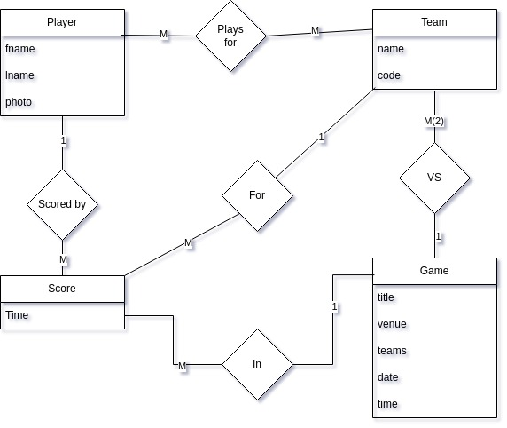

# Actix Web + DynamoDB CRUD API

A match-team-player API developed utilizing Actix Web and DynamoDB (Single table design pattern)

## Queries
- Get all teams
- Get a single team
- Get players of a team
- Get a single player
- Get a match
- Get scores of a match
- Get scores of a player in all matches

## Prefixes
|   Prefix  |   Entity  |
|   -----   |   -----   |
|   P       |   Player  |
|   T       |   Team    |
|   G       |   Match   |
|   S       |   TimeStamp|

